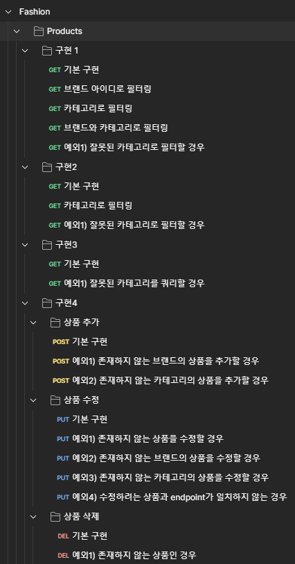
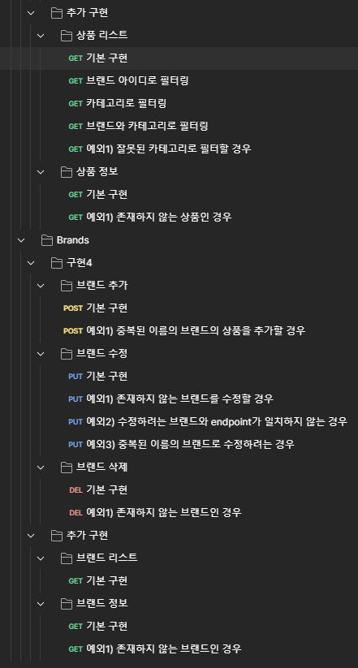

# JAVA Backend Project


## 1. 개발 언어 및 환경


- **Java**: 21
- **SpringBoot**: 3.3.1
- **Build Tool**: Gradle
- **Database**: H2 (In-memory)
- **ORM**: JPA

<br>

## 2. 실행 및 테스트
### 실행

- **실행**: 프로젝트 루트 폴더에서 ./gradlew bootRun 명령어 실행 
- **Port**: 8080 
- **Swagger**: /docs에 접속, 또는 ./docs/swagger.json 파일로 확인 가능

### H2
- /h2에서 확인 가능
  - **Saved Settings**: Generic H2 (Embedded)
  - **Driver Class**: `org.h2.Driver`
  - **JDBC URL**: `jdbc:h2:mem:fashion`
  - **User Name**: `test`
  - **Password**: `test`
  - 데이터는 application 재실행시마다 항상 주어진 데이터로 리셋됩니다. (DataInitializer.java 확인)

### 테스트
- 모든 API의 응답 상황에 대한 통합 테스트 코드가 BrandIntegrationTest 와 ProductIntegrationTest 클래스에 정의되어 있습니다.
  - 모든 테스트코드는 메소드 단위로 실행함을 가정하여 작성하였습니다.
- ./docs/postman_collection.json 파일에 모든 api가 정의되어 있습니다.
  - 가능한 모든 4XX error에 대한 케이스도 추가적으로 쉽게 실행만으로 테스트해 볼 수 있도록 정의되어 있습니다.
  <details> <summary> postman으로 정리된 api collection</summary>
    
    
  </details>

<br>

## 3. 주어진 조건 구체화

본 프로젝트에서는 유연한 상황 대처를 위해 아래와 같은 조건을 가정하였습니다.

### 조건 1: 브랜드와 카테고리의 관계
- 하나의 브랜드는 각 카테고리별로 0개 또는 1개 이상의 상품을 가질 수 있다.
- 구현 2에서, 특정 브랜드의 상품이 1개 이상의 카테고리에서 존재하지 않는다면 해당 브랜드를 선택하지 않는다.
- 구현 2에서, 모든 브랜드의 상품이 1개 이상의 카테고리에서 존재하지 않는다면 204 (No Content) 응답을 보낸다.


### 조건 2: 상품이 없는 카테고리
- 특정 카테고리는 어떠한 상품도 가지고 있지 않은 경우가 생길 수 있다.
- 구현 1와 구현2에서, 특정 카테고리가 어떠한 상품도 가지고 있지 않은 경우, 해당 카테고리의 브랜드와 상품 아이디는 null, 가격은 0이 된다.
- 구현 3에서, 원하는 카테고리에 상품이 없는 경우, 204 (No Content) 응답을 보낸다.

### 조건 3: 상품과 브랜드의 고유 id
- 특정 브랜드의 특정 카테고리에 2개 이상의 상품이 존재할 수 있으므로, 하나의 상품을 삭제하기 위해서는 해당 상품의 id를 사용한다
- 그 뿐만 아니라 모든 CRUD는 id를 바탕으로 진행되는 것이 실제 개발 환경에서 더 자연스럽다고 판단하여 id 기반으로 CRUD를 작업한다.

### 조건 4: 복수의 최적해
- 구현 1과 구현 2에서는 문제를 단순화하기 위하여 다수의 최적해가 있을 경우, id가 작은 상품이 높은 우선순위를 가진다고 가정한다.
- 구현 3은 모든 최적해를 응답에 포함시킨다.

### 조건 5: 브랜드와 상품 삭제
- 브랜드가 삭제되면 해당 브랜드의 상품도 모두 삭제되어야 한다고 가정한다.
- 실제 구현에서는 database에서 데이터를 완전히 제거시키지 않고 delete_time과 같은 column에 삭제한 시간을 적어두는 방식을 사용하는 것이 고려되어야한다.

<br>

## 4. 도메인 설계

주어진 조건에서 모든 상품은 해당 속성을 갖고 있음을 알 수 있습니다.
- **브랜드**
- **가격**
- **카테고리**

아래의 상황 등을 고려했을 때 상품 별 고유 아이디가 필요할 것임을 예측할 수 있습니다. 
- 상황1. 하나의 브랜드의 한 카테고리에 여러 상품이 추가될 경우
- 상황2. 특정 상품에 대한 요청이 있을 경우 (재고 관리, 개별 구매 등)
- 상황3. 위의 "주어진 조건 구체화"에서 정의한 조건 3

또한 브랜드의 경우에는 브랜드만의 고유 데이터를 갖고 있을 수 있기 때문에 별도의 도메인으로 취급하는 것이 확장하기 용이합니다.

따라서 필요한 도메인을 아래와 같이 정의하였습니다.

```java
class Product {
  String id;
  String brandId;
  ProductCategory category;
  int price;
}

class Brand {
  String id;
  String brandName;
}
```
id는 실제 개발 환경에 따라 다양하게 설정가능하겠지만, 해당 프로젝트에서는 Database 에는 UUID 값이 들어가고,
도메일 레이어에서는 Base62로 인코딩 하였다고 가정하였습니다.

<br>

## 5. API 설계
### endpoint 구성
기본 CRUD는 다음과 같은 endpoint를 갖게 하였습니다.

### `/products` (GET / POST)
- **GET**: 전체 products 리스트 (filter 사용 가능)
- **POST**: 새로운 상품 추가

### `/products/{products_id}` (GET / PUT / DELETE)
- **GET**: products_id 정보
- **PUT**: products_id 상품 정보 수정
- **DELETE**: products_id 삭제

### `/brands` (GET / POST)
- **GET**: 전체 brands 리스트
- **POST**: 새로운 브랜드 추가


### `/brands/{brand_id}` (GET / PUT / DELETE)
- **GET**: brand_id 정보
- **PUT**: brand_id 브랜드 정보 수정
- **DELETE**: brand_id 삭제

여기에 추가로, 구현 1~3의 경우는 custom 한 요청을 처리하는 api 라고 생각되었습니다.
해당 요청들을 처리하기 위한 api의 경우 아래와 같이 endpoint를 설정하였습니다.
- **구현 1**: `/products:lowestPriceOutfit` (filter 사용 가능)
- **구현 2**: `/products:lowestPriceOutfitBrand`
- **구현 3**: `/products:priceRangeByCategory`

이러한 endpoint 구성에는 JJ Geewax의 *API Design Patterns* 책을 참고했습니다.

api의 request와 response, error 처리에 대한 상세한 사항은 /docs로 접속하거나 ./docs/swagger.json 파일을 통해서 확인해보실 수 있습니다.

<br>

## 6. 코드 구조

### 전체 구조

- **Layers**:
  - Presentation Layer
  - Application Layer
  - Domain Layer
  - Infrastructure Layer
- 도메인 주도 설계를 의도하였습니다.

### 패키지 구조

- 패키지 구조는 Layer 기반보다는 Domain 기반이 아래의 측면에서 좋은 면이 있다고 생각되어 Domain 기반으로 구성하였습니다.
  - 높은 cohesion 과 낮은 coupling
  - 그로 인한 높은 modularity
  - 하나의 feature 에 대해 작업할 때 폴더 간에 움직여야하는 상황이 적음
  
### Layer별 작업

- **Controller**: request를 받아 service에게 넘겨준 후 service에서 리턴해준 값을 response로 보내주는 역할만 하도록 하였습니다.
- **Service**: controller에서 넘겨준 request를 적절히 해석하여 필요한 값을 repository에게 요청한 후, 필요한 로직을 수행하는 코어 기능을 하도록 하였습니다.
- **Repository**: 요청되는 값을 query를 통해 Database에서 불러와서 return하는 역할을 하도록 하였습니다.

### Layer별 사용 모델

- **Controller**: 사용되는 모델은 사용성에 따라 ~DTO, ~Request, ~Response라 명명하였습니다.
- **Service**: domain 모델을 직접 사용하였습니다. Application Layer에서만 사용할 DTO를 따로 정의하는 방법도 있지만, 해당 프로젝트의 경우에는 아직 서비스의 사용처가 다양하지 않아 오히려 과도한 DTO간의 매핑이 이루어질수 있다고 판단하였습니다.
- **Repository**: 사용되는 모델은 ~Entity로 명명하였으며 이는 Database table과 1:1 대응됩니다.

### 추가 사항
- **유효성 검사**: ProductCategoryValidator class 를 만들어 요청으로 들어오는 category 에 대해 일관성 있는 유효성 검사를 진행하였습니다.
- **에러 처리**: 사용되는 에러는 utils/exception에서 관리하고 GlobalExceptionHandler로 처리될 수 있도록 하였습니다.

<br>

## 7. 추가 고려해볼 사항
- **쿼리효율**: 현재 구현 1~3에서는 한번의 쿼리를 통해 원하는 값을 가져왔습니다. 이는 카테고리별로 여러번 쿼리를 호출했을 때보다 더 나은 퍼포먼스를 보여줄 거라는 가정을 하였기 때문입니다.
  <br>하지만 이런 구현은 유지보수를 어렵게 만들 수 있고 실제로는 효율이 떨어질 수 있기 때문에 실제 구현에서는 지속적인 모니터링을 통해 쿼리의 최적화가 필요할 것으로 예상됩니다.
- **Database 인덱싱**: 본 프로젝트에서 Database index는 사용 중인 쿼리를 바탕으로 성능을 예측하여 구성하였습니다. 
  <br>하지만 실제로는 훨씬 더 다양한 쿼리와 상황이 해당 테이블들에 발생할 것이기 때문에 지속적인 모니터링을 통한 재구성이 필요할 것으로 생각됩니다.
- **Pagination**: 본 프로젝트에서는 단순화를 위해 pagination을 진행하지 않았지만, 실제 개발에서는 대부분의 GET API에 pagination이 필요할 것으로 보입니다.
- **API 호출 조건**: 현재는 Product에 대한 CRUD가 제약 없이 이루어지고 있지만, 실제 개발에서는 특정 브랜드는 특정 브랜드의 상품만 CRUD 할 수 있는 것이 더 자연스러울 것으로 예상됩니다.
<br>그렇게 된다면, api endpoint 설계도 /products 를 /brands/{brand_id}/products 로 사용하는 것이 더 적절할 것으로 생각됩니다.
- **Data 추가 정보 및 제약**: 실제 구현에서는 브랜드와 상품에 대해 create_time, update_time 등의 기타 메타 정보도 함께 포함해야할 수 있습니다.
<br>또한 브랜드 이름의 길이 제한 등의 데이터 타입에 대한 제한 사항이 추가될 수 있습니다.